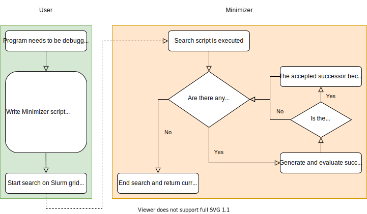

How Does It Work?
=================

.. _workflow:

    
    Machetli Usage Workflow

Machetli is based on a few key ideas:

- The problem :ref:`state<state_concept>`, which is simply a Python dictionary containing your runs and other useful data. You must define an initial state from where the search is started.
- At least one :ref:`successor generator<succ_gen_concept>`, which yields modified versions (successors) of the current state. Modifications to the state can be anything from manipulations of internal data structures to changes in program inputs.
- An :ref:`evaluator<evaluator_concept>`, which determines whether a given state has the properties you are looking for.

.. _state_concept:

States
------
As mentioned above, a state is a Python dictionary. You can store in it anything you want behind any keyword, with a few exceptions:

- The keyword ``"runs"`` is reserved, because Machetli expects instances of the :class:`Run<machetli.run.Run>` class to be stored in a sub-dictionary behind this keyword:

 .. code-block:: python

    initial_state = {
        "runs": {
            "awesome_run": Run(
                # Some awesome run command
            ),
            "amazing_run": Run(
                # Some amazing run command
            ),
        }
    }

- When using one of the context managers from the :mod:`auxiliary module <machetli.planning.auxiliary>`, the following keywords are reserved:

    - ``"pddl_task"``
    - ``"sas_task"``
    - ``"generated_pddl_domain_filename"``
    - ``"generated_pddl_problem_filename"``
    - ``"generated_sas_filename"``

.. _succ_gen_concept:

Successor Generators
--------------------
A successor generator is a class defining how successors of a :ref:`state<state_concept>` are created.
It should implement the :class:`SuccessorGenerator<machetli.planning.generators.SuccessorGenerator>` interface with the :meth:`get_successors(state)<machetli.planning.generators.SuccessorGenerator.get_successors>` method. Machetli expects :meth:`get_successors(state)<machetli.planning.generators.SuccessorGenerator.get_successors>` to return a `Python generator <https://docs.python.org/3/glossary.html#term-generator>`_ that yields successors of a state. Successor generators can be passed to Machetli 

.. :ref:`search function<search_function>` via their class name:

.. code-block:: python
    :emphasize-lines: 2,12
    :name: succ_gen_exmpl

    from machetli.search import first_choice_hill_climbing
    from machetli.planning.generators import RemoveObjects
    from machetli.evaluator import ParsingEvaluator

    class FindString(ParsingEvaluator):
        # For an actual implementation of this, look into the Evaluators section below

    # Fortunately, we have a create_initial_state function to set up the initial state for us:
    initial_state = create_initial_state()

    # Start the search:
    result = first_choice_hill_climbing(initial_state, RemoveObjects, FindString)

If you want the search to be executed serially with multiple successor generators, you can pass a list of their class names in the order you want them to be used. The search result with each of the successor generators then becomes the initial state of the search with the following one:

.. code-block:: python

    from machetli.planning.generators import RemoveActions

    result = first_choice_hill_climbing(initial_state, [RemoveObjects, RemoveActions], FindString)

The :mod:`machetli.planning.generators` module provides a collection of readily available successor generators for PDDL and SAS\ :sup:`+` tasks.

.. _evaluator_concept:

Evaluators
----------
An evaluator is a class defining how a :ref:`state<state_concept>` is evaluated. Machetli search requires each state to either be accepted or rejected. An evaluator should implement the :class:`Evaluator<machetli.evaluator.Evaluator>` interface with the :meth:`evaluate(state)<machetli.evaluator.Evaluator.evaluate>` method which is expected to return ``True`` if the state is accepted and ``False`` otherwise. The :mod:`machetli.run` module provides classes and functions to make life a little easier when specifying the programs to be executed and actually executing them (which is typically done at some point when :meth:`evaluate(state)<machetli.evaluator.Evaluator.evaluate>` is called).

Example evaluator implementation:

.. code-block:: python

    from machetli.parser import Parser
    from machetli.evaluator import ParsingEvaluator

    parser = Parser()

    # Simple parser function to check whether a string can be found in the command-line output:
    def assertion_error(content, props):
        string = "AssertionError: Negated axiom impossible"
        props["assertion_error"] = string in content

    parser.add_function(assertion_error, "issue335")

    class FindString(ParsingEvaluator):
        parsers = parser

        def interpret_results(self, results):
            return results["issue335"]["stderr"]["assertion_error"]

This evaluator could be used in the :ref:`example above<succ_gen_exmpl>`.
