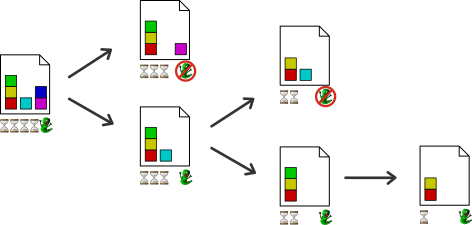
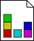
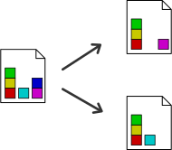
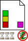

Overview
========

.. raw:: html

    

    <video autostart="false" controls>
        <source src="https://ai.dmi.unibas.ch/videos/machetli-icaps2022demo.mp4" type="video/mp4">
        Your browser does not support the video tag. You can download the video
        <a href="https://ai.dmi.unibas.ch/videos/machetli-icaps2022demo.mp4">here</a>
    </video>
    

Search
------

    
    Machetli runs a hill-climbing search

Machetli runs a hill-climbing search in a space of instance transformations.
This means that it starts with some instance (for example the instance where you
observed a bug that you want to find) and modifies it in different ways to reach
*successors*. It then *evaluates* successors to check whether the behavior in
question is still present. If it is, Machetli's search continues from this instance.
The search continues like this until no successor exhibits the behavior any more.

States
------

    
    A state represents an instance

Machetli stores modified instances in *states* which are simply Python
dictionaries containing the instance. You must define an initial state from
where the search is started. The packages :mod:`machetli.pddl` and
:mod:`machetli.sas` provide functions for this.

If you plan to :ref:`extend Machetli <extending-machetli-file-type>` to a new
file type, you can store whatever information you want in a state.

Successor Generators
--------------------

    
    Successor generators modify the instance

Successor generators yield modified versions (successors) of a given state.
Modifications to the state can be anything from manipulations of internal data
structures to changes in program inputs.

The packages :mod:`machetli.pddl` and :mod:`machetli.sas` provide a collection
of readily available successor generators for PDDL and SAS\ :sup:`+` tasks but
you can also :ref:`write your own <extending-machetli-successor-generator>`.

Evaluators
----------

    
    Evaluating a state

Every state that is generated during the search will be evaluated to check if it
still has the behavior you are looking for. This is done by an *evaluator*
script, a Python script containing a single function :meth:`evaluate` that returns
``True`` if the behavior is still present. The main part in setting up Machetli
for your use case is :ref:`writing an evaluator script <usage-evaluator>` to
reproduce the behavior you are interested in.
